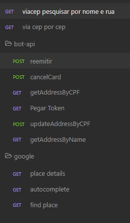

<p align="center">
  </a>
</p>


## Technologias usadas neste projeto

<a href="https://www.npmjs.com/package/typescript/" target="_blank"></a> <a href="https://docs.docker.com/get-started/" target="_blank"></a>   <a href="https://gitlab.com/Fortbrasil/microservicos/microservice-sendmail" target="_blank"></a>


# API - ChatBot WhatsApp
API com vários EndPoints a serem usados pela Plataforma ALTU de ChatBot WhatsApp

# Subindo o Projeto via Docker
```bash

// para construir imagem
sudo docker build -t bot-api .

// para criar o container e publicar porta 3000
sudo docker run -p 3000:3000 --env-file .env --name bot-api-container bot-api start
```
## Endpoint´s Usados nesta API

